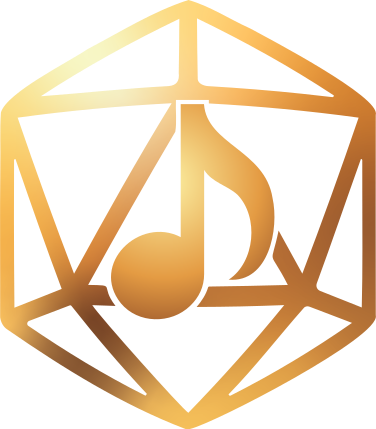

<div align="center">
  
  <h1>DungeonMaestro</h1>
  <p>A Soundboard application for Dungeon Masters.</p>
</div>

---

## 🎭 Features

DungeonMaestro empowers your tabletop RPG sessions with:

- 🎵 Stable playback for both audio files and YouTube links
- 🏞️ Organized scenes for easy access and management
- 📱 Responsive design layout tailored for TTRPG players

## 🚀 Installation

1. Visit the [Releases](https://github.com/yourusername/DungeonMaestro/releases) page
2. Download the latest version for your operating system
3. Run the installer and follow the on-screen instructions

## 🎮 Usage

1. **Create a Scene**: Click on the top-right menu and select "Add Scene"
2. **Add Sounds**: In the Scene dropdown, click "Add Sound"
3. **Set Sound Source**: Specify a file path OR a valid YouTube URL
4. **Start the Adventure**: Begin playing and immerse your players!

## 🛠️ Development Environment

To set up the development environment, you'll need:

- Node.js (v14.0.0 or later)
- npm (v6.0.0 or later)
- Electron (v13.0.0 or later)
- SQLite3

Clone the repository and install dependencies:
```bash
git clone https://github.com/yourusername/DungeonMaestro.git
cd DungeonMaestro
npm install
```

## 🗺️ Roadmap
Future enhancements planned for DungeonMaestro:

- Spotify integration
- File explorer interface for AddSound
- Auto-update functionality

## 📜 License
This project is licensed under the MIT License - see the LICENSE file for details.

## 🙏 Acknowledgements
- Electron for making cross-platform desktop apps easy
- SQLite for reliable local data storage
- All the amazing Dungeon Masters who inspired this project!

<div align="center">
  Made with ❤️ by Gabe Lytle
</div>
